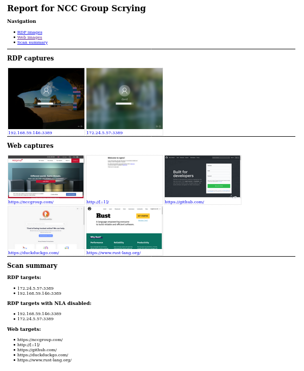

# NCC Group Scrying
A new tool for collecting RDP, web and VNC screenshots all in one place

This tool is still a work-in-progress and should be mostly usable but is not yet complete.
Please file any bugs or feature requests as [GitHub issues](https://github.com/nccgroup/scrying/issues)

## Caveats
* Web screenshotting relies on Chromium or Google Chrome being installed
* VNC has not been implemented

## Motivation
Since Eyewitness recently [dropped support for RDP](https://github.com/FortyNorthSecurity/EyeWitness/issues/422#issuecomment-539690698) there isn't a working CLI tool for capturing RDP screenshots.
Nessus still works, but it's a pain to get the images out and they're not included in the export file.

I thought this was a good opportunity to write a fresh tool that's more powerful than those that came before. Check out the feature list!

## Installation
For web screenshotting, scrying currently depends on there being an installation of Chromium or Google Chrome. Install with `pacman -S chromium` or the equivalent for your OS.

Download the latest release from [the releases tab](https://github.com/nccgroup/scrying/releases). There's a Debian package available for distros that use them (install with `sudo dpkg -i scrying*.deb`), and zipped binaries for Windows, Mac, and other Linuxes.

## Usage
Grab a single web page or RDP server:
```
$ scrying -t http://example.com
$ scrying -t rdp://192.0.2.1
$ scrying -t 2001:db8::5 --mode web
$ scrying -t 2001:db8::5 --mode rdp
$ scrying -t 192.0.2.2
```

Automatically grab screenshots from an nmap output:
```
$ nmap -iL targets.txt -p 80,443,8080,8443,3389 -oX targets.xml
$ scrying --nmap targets.xml
```

Choose a different output directory for images:
```
$ scrying -t 2001:db8::3 --output-dir /tmp/scrying_outputs
```

Run from a targets file:
```
$ cat targets.txt
http://example.com
rdp://192.0.2.1
2001:db8::5
$ scrying -f targets.txt
```

Run through a web proxy:
```
$ scrying -t http://example.com --web-proxy http://127.0.0.1:8080
$ scrying -t http://example.com --web-proxy socks5://\[::1\]:1080
```

Image files are saved as PNG in the following directory structure:
```
output
├── rdp
│   └── 192.0.2.1-3389.png
└── web
    └── https_example.com.png
```

## Features:
Features with ticks next to them have been implemented, others are TODO
* ✔️ Automatically decide whether an input should be treated as a web address or RDP server
* ✔️ Automatically create output directory if it does not already exist
* ✔️ Save images with consistent and unique filenames derived from the host/IP
* ✔️ Full support for IPv6 and IPv4 literals as well as hostnames
* ✔️ Read targets from a file and decide whether they're RDP or HTTP or use hints
* ✔️ Parse targets smartly from nmap output
* ✔️ HTTP - uses Chromium/Chrome in headless mode
* ✔️ Full cross-platform support - tested on Linux, Windows and Mac
* RDP - mostly working, needs better heuristic for determining when it has received a full login/desktop screen image, see [#2](https://github.com/nccgroup/scrying/issues/2)
* VNC - tracking issue [#6](https://github.com/nccgroup/scrying/issues/6)
* Video streams - tracking issue [#5](https://github.com/nccgroup/scrying/issues/5)
* option for timestamps in filenames
* Read targets from a msf services -o csv output
* Parse targets smartly from nessus output - [WIP](https://github.com/sciguy16/nessus_xml_parser-rs)
* OCR on RDP usernames, either live or on a directory of images
* Readme has pretty pictures of the output
* NLA/auth to test credentials
* Parse Dirble JSON output to grab screenshots of an entire website - waiting for [nccgroup/dirble#51](https://github.com/nccgroup/dirble/issues/51)
* Produce an HTML report to allow easy browsing of the results - tracking issue [#7](https://github.com/nccgroup/scrying/issues/7)

## Help text
```
USAGE:
    scrying [FLAGS] [OPTIONS]

FLAGS:
    -h, --help           Prints help information
    -s, --silent         Suppress most log messages
        --test-import    Exit after importing targets
    -v, --verbose        Increase log verbosity
    -V, --version        Prints version information

OPTIONS:
    -f, --file <file>...             Targets file, one per line
    -l, --log-file <log-file>        Save logs to file
    -m, --mode <mode>                Force `web` or `rdp` [default: auto]
        --nmap <nmap>...             Nmap XML file
    -o, --output-dir <output-dir>    Directory to save the captured images in [default: output]
    -t, --target <target>...         Target, e.g. http://example.com
        --threads <threads>          Number of worker threads for each target type [default: 3]
        --timeout <timeout>           [default: 10]
```

## Sample HTML report
